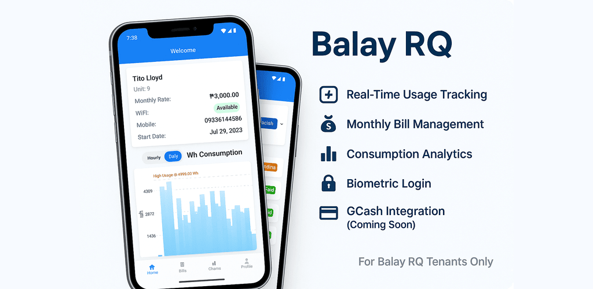
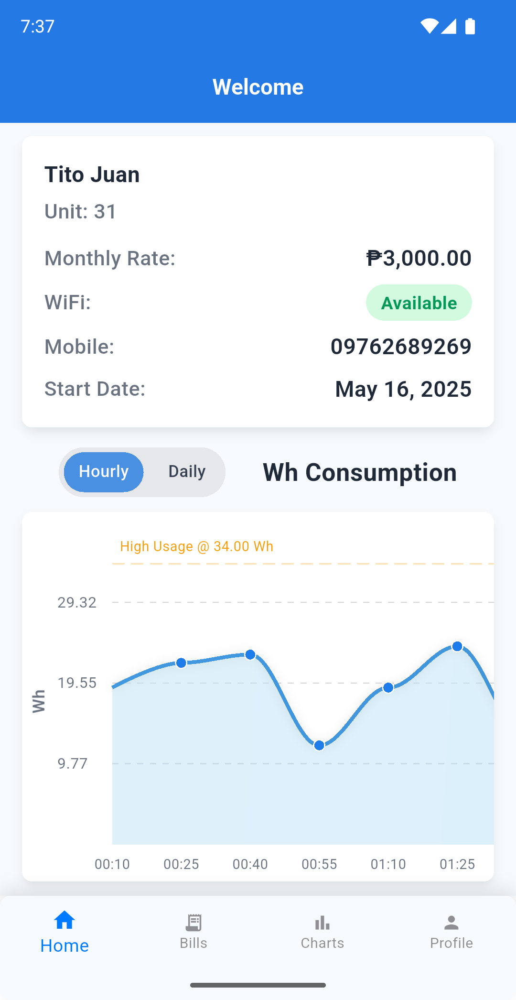
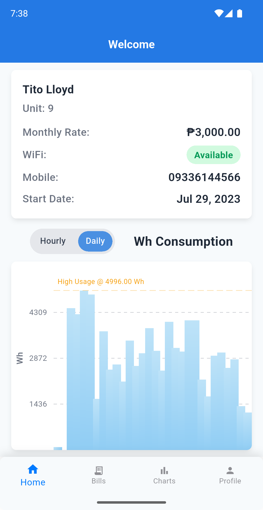
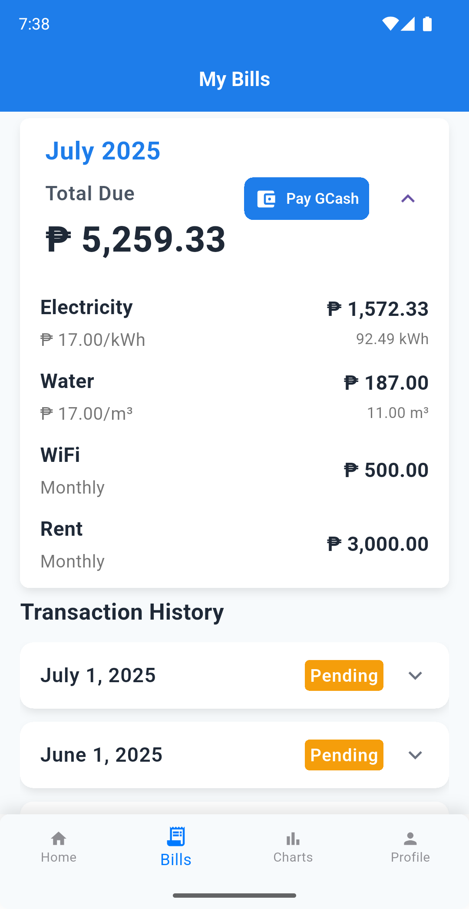
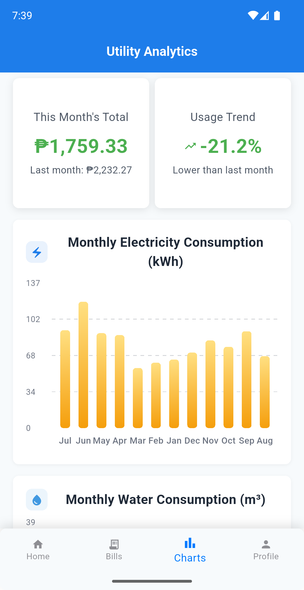
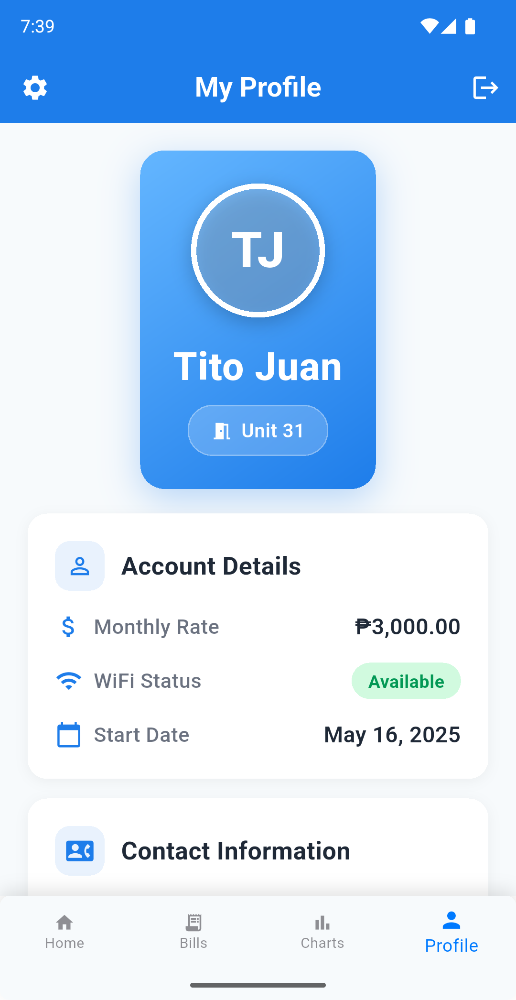
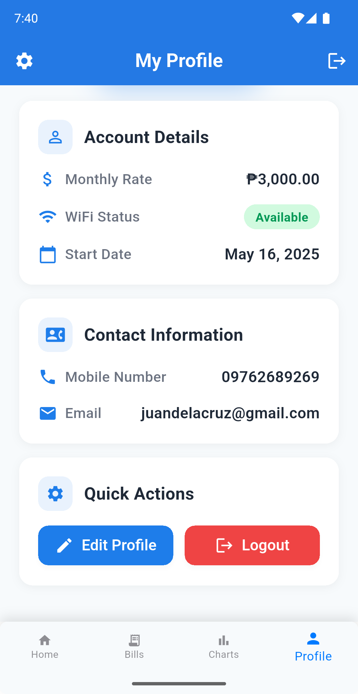

<p align="center">
  
</p>

# RQ Balay Tracker

A Flutter application for tracking electricity and water consumption with billing features.

---

## Table of Contents

- [Overview](#overview)
- [Features](#features)
- [Architecture](#architecture)
- [Tech Stack](#tech-stack)
- [Directory Structure](#directory-structure)
- [Setup Instructions](#setup-instructions)
- [Usage](#usage)
- [Screenshots](#screenshots)

---

## Overview

**RQ Balay Tracker** is a modern Flutter application designed to help users monitor and manage their electricity and water consumption. The app provides detailed billing history, interactive consumption charts, and supports both mobile and tablet devices with a responsive UI. It leverages Firebase for authentication, notifications, and data management, ensuring a secure and seamless experience.

---

## Features

- **User Authentication**
  - Secure login with support for biometric authentication (Face ID, Fingerprint)
- **Bill Tracking & History**
  - View, filter, and analyze past electricity and water bills
- **Consumption Charts**
  - Interactive charts for electricity and water usage (powered by [fl_chart](https://pub.dev/packages/fl_chart))
- **Responsive Design**
  - Optimized layouts for both mobile and tablet devices
- **Shimmer Loading States**
  - Smooth loading placeholders for data fetching
- **Firebase Integration**
  - Authentication, Firestore, and FCM (push notifications)
- **Modern UI/UX**
  - Clean, accessible, and user-friendly interface

---

## Architecture

The project uses a **feature-based, layered architecture** with a clean separation of concerns, following best practices for maintainability and scalability:

- **Feature Modules**: Each major feature (e.g., Auth, Bills, Charts, Landing Page, Profile) is organized under `lib/features/[feature]/`.
  - **data/**: Data sources, models, repositories for the feature
  - **domain/**: Business logic, entities, and use cases (where applicable)
  - **presentation/**: UI screens, widgets, shimmers, and view models/providers
- **Core Layer** (`lib/core/`): Shared utilities, services, themes, reusable widgets, and global models
  - **config/**: App configuration
  - **global/**: Global models (e.g., current user)
  - **logger/**: Logging utilities
  - **model/**: Shared models
  - **services/**: Shared services (API, device info, Firebase, etc.)
  - **theme/**: App colors, gradients, text styles
  - **usecases/**: Shared use cases
  - **utils/**: Utility functions/helpers
  - **widgets/**: Reusable widgets (buttons, inputs, etc.)

**State Management:**

- Uses the Provider pattern (`ChangeNotifier`) for state management, with focused providers per feature.
- Follows MVVM principles for separation between UI and business logic.

**UI/UX:**

- Responsive layouts for mobile and tablet
- Shimmer loading states for smooth UX
- Consistent design system using core theme and widget utilities

**Other Practices:**

- JSON serialization for models
- Error handling and logging via core utilities
- Secure storage and proper session management for authentication

This structure ensures clear boundaries between features, easy scalability, and maintainability.

---

## Tech Stack

- **Flutter** (UI framework)
- **Provider** (state management)
- **Firebase** (authentication, Firestore, FCM)
- **fl_chart** (charts and graphs)
- **Shimmer** (loading placeholders)

---

## Directory Structure

```
lib/
  core/
    config/           # App configuration
    global/           # Global models (e.g., current user)
    logger/           # Logging utilities
    model/            # Shared models
    providers/        # Shared providers
    services/         # Shared services (API, device info, etc.)
    theme/            # App colors, gradients, text styles
    usecases/         # Shared use cases
    utils/            # Utility functions/helpers
    widgets/          # Reusable widgets (buttons, inputs, etc.)
  features/
    auth/
      data/           # Data sources, models, repositories
      domain/         # Entities, repositories, use cases
      presentation/   # Screens, widgets (login, etc.)
    bills/
      data/           # Bill models, services
      presentation/   # Bill screens, shimmers, widgets
    charts/
      model/          # Chart models
      view/           # Chart screens, shimmers, widgets
      viewmodel/      # Chart view models
    landing_page/
      model/          # Landing page models
      view/           # Landing page screens, widgets, shimmers
      viewmodel/      # Landing page view models
    profile/
      model/          # Profile page models
      view/           # Profile screens, widgets, shimmers
      viewmodel/      # Profile view models
```

---

## Setup Instructions

### 1. Prerequisites

- [Flutter SDK](https://docs.flutter.dev/get-started/install) (latest stable)
- [Dart](https://dart.dev/get-dart)

### 2. Clone the Repository

```bash
git clone https://github.com/your-username/rq_balay_tracker.git
cd rq_balay_tracker
```

### 3. Install Dependencies

```bash
flutter pub get
```

### 4. Generate a New Signing Key (Keystore)

If you do not have an existing signing key for your app, you need to generate a new one to sign your APK or app bundle for release. Run the following command in your project directory:

```bash
keytool -genkeypair -v -keystore android/app/upload-keystore.jks -keyalg RSA -keysize 2048 -validity 10000 -alias upload
```

You will be prompted to enter passwords and other information. Save these values securely and update your `key.properties` file accordingly. For more details, see the [Flutter Android deployment documentation](https://docs.flutter.dev/deployment/android).

### 5. Run the App

```bash
flutter run
```

---

## Usage

- **Login**: Authenticate using email/password or biometrics (if enabled)
- **View Bills**: Navigate to the Bills screen to see your billing history and details
- **Analyze Consumption**: Use the Charts section to view electricity and water usage trends
- **Responsive UI**: The app adapts to both mobile and tablet layouts automatically
- **Notifications**: Receive push notifications for important updates (ensure notification permissions are granted)

---

## Screenshots

<p align="center">
  
  
  
  
  
  
</p>

---
